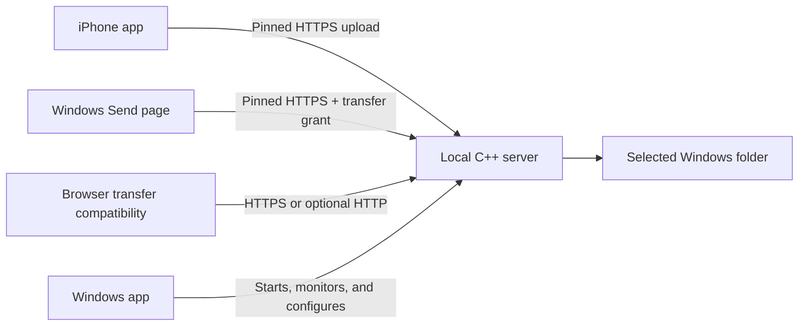

<p align="center">
  
</p>

<h1 align="center">Local Media Transfer</h1>

<p align="center">
  <i>Send files between Windows computers or move media from iPhone to Windows over your local network. No cloud account required.</i>
</p>

<p align="center">
  
  
  
  
</p>

---

## What is this?

Local Media Transfer is one dual-role Windows desktop app plus an iPhone
companion app for fast local transfer. Windows computers can send or receive;
iPhone and browser clients send to the Windows receiver. No cloud rendezvous,
account quota, USB cable, or public Internet service is required.

The Windows app starts a local transfer server and provides separate Receive
and Send pages. Native Windows pairing pins the receiver certificate and every
transfer requires receiver approval. The iPhone app keeps its QR/discovery and
pinned-HTTPS flow, and Browser transfer remains a compatibility option.

## Who is it for?

- iPhone users who want a local-first way to move photos and videos to Windows.
- Windows users who want to send ordinary files directly to another Windows PC.
- People who do not want cloud storage to be part of the transfer path.
- Developers who want a local transfer stack with a Windows GUI, C++ server,
  browser fallback, and Expo/Swift iOS client.

## How it works

1. On a receiving Windows PC, open **Receive**.
2. For another Windows PC, open pairing for two minutes; on the sender open
   **Send**, scan or enter the private IPv4 address, and compare the security code.
3. Choose up to 1,000 files and request transfer approval.
4. For iPhone, scan the separate iPhone QR code and approve the device.
5. Use **Browser transfer (compatibility)** only when a native client is
   unavailable. Create its single-use five-minute link manually, then copy it
   or let the other phone, tablet, or computer scan the separate browser QR.



## Install and use

### Windows

Use the Windows installer when a release build is published. If you are building
from source, see the developer guide:

- [Windows GUI developer guide](src/LocalMediaTransfer.GUI/README.md)
- [Installer build guide](tools/LocalMediaTransfer.InnoSetup/README.md)

After opening the Windows app:

- choose the upload folder;
- use **Send** to discover or pair with another Windows receiver and select files;
- keep HTTPS enabled for normal use;
- scan the QR code from the iPhone app;
- approve new iPhones before they can transfer files.

### iPhone

The installed iOS app is the preferred experience. It supports certificate-pinned
HTTPS, nearby desktop discovery, Windows approval, trusted reconnect, and native
raw uploads.

This project is not currently distributed through Apple's store. The repository
contains a manual GitHub Actions workflow that builds an unsigned IPA on macOS;
Sideloadly on Windows can then sign and install that IPA with a free Apple ID.

- [iOS developer guide](src/LocalMediaTransfer.iOS/README.md)
- [Unsigned IPA + Sideloadly guide](docs/IOS_SIDELOADLY.md)

### Expo Go and browser fallback

Expo Go is useful for UI development, but it cannot load the custom Swift module
used by the installed iOS app. It uses the compatibility upload path and requires
the Windows app's insecure HTTP option to be explicitly enabled.

The Browser transfer page is a compatibility option. It is useful when the
native app is unavailable, but HTTPS native app transfer is the preferred path.

## Security in plain language

- Normal app transfer uses HTTPS with a pinned local certificate.
- The QR code establishes first trust and includes a temporary session token.
- Windows approval is still required before a new iPhone becomes trusted.
- Trusted devices use their own device credential after approval; rotating the
  QR/session token does not revoke already trusted iPhones.
- Nearby discovery does not advertise tokens or device credentials.
- HTTP fallback is opt-in, not encrypted, and should be used only for
  compatibility or development.
- Do not expose the local transfer server to the public Internet.

Read the full security and privacy docs before deployment or contribution:

- [Security policy](SECURITY.md)
- [Privacy notes](PRIVACY.md)
- [Discovery and pairing](docs/DISCOVERY_AND_PAIRING.md)

## Features

| Feature | What it does |
|:---|:---|
| Windows desktop app | Shows QR pairing, server state, network/security settings, speed, history, and upload folder controls. |
| Native iOS app | Connects to Windows, validates pinned HTTPS, selects media, and uploads in native chunks. |
| Duplicate detection | Verifies existing files with server-computed SHA-256 before skipping. |
| Transfer history | Keeps local transfer statistics in the Windows app. |
| Browser compatibility | Provides a local upload page when the installed iOS app is unavailable. |
| Nearby discovery | Optional credential-free local desktop discovery for trusted reconnects. |

## For developers

This is a monorepo because the Windows GUI, C++ server, iOS app, browser
frontend, and integration tests depend on the same protocol and security model.

Start with the component guide for the area you are changing:

- [iOS app](src/LocalMediaTransfer.iOS/README.md)
- [Windows GUI](src/LocalMediaTransfer.GUI/README.md)
- [C++ server](src/Server/README.md)
- [Upload protocol](docs/UPLOAD_PROTOCOL.md)
- [Native Windows protocol](docs/NATIVE_WINDOWS_PROTOCOL.md)
- [Native Windows two-PC acceptance](docs/NATIVE_WINDOWS_TWO_PC_ACCEPTANCE.md)
- [Deduplication](docs/DEDUPLICATION.md)
- [Benchmarking](docs/BENCHMARKING.md)
- [Architecture notes](docs/architecture.md)
- [User-facing changelog](CHANGELOG.md)
- [Release process](docs/RELEASING.md)
- [Publication checklist](docs/PUBLICATION_CHECKLIST.md)

Useful root-level verification command:

```powershell
powershell -NoProfile -ExecutionPolicy Bypass -File .\scripts\verify.ps1 -Target all
```

Contributors should also read:

- [Contributing guide](CONTRIBUTING.md)
- [Third-party notices](THIRD_PARTY_NOTICES.md)
- [Security policy](SECURITY.md)
- [User-facing changelog](CHANGELOG.md)

## License

Licensed under the [Apache License 2.0](LICENSE).
